# SiegenX – E-commerce Platform for Portable Monitors
---

## 📌 Introduction

**SiegenX** is an e-commerce platform specializing in high-quality portable monitors, designed to serve the needs of modern office workers, gamers, and remote professionals.

The project delivers a seamless shopping experience through a fast, scalable **web** and **mobile application** ecosystem.

---

## 🧱 System Architecture

The SiegenX system follows a modern microservices architecture focused on scalability, performance, and developer productivity.

### 🔧 Technologies Used

- **Frontend Web**: `ReactJS` with `lazy-loading` for performance and minimal load times.
- **Mobile App**: Built with `Flutter` for smooth, cross-platform shopping experience.
- **Backend**: `NodeJS` microservices, including:
    - **Api Gateway**
    - **User Authentication**
    - **Product Service**
    - **Payment Service**
    - **Profile Service**
    - **Staff Service**
    - **Supplier Service**
<p align="center">
  
</p>

- **Cluster Mode**: Each service runs in clustered mode to leverage multi-core CPUs and improve load tolerance.
- **Database**:
  - `MongoDB` for user, product, staff, order, supplier and order data
  - `Redis` for shopping cart and session management
- **Monitoring**:
  - `Prometheus` and `Grafana` for real-time performance tracking
- **Design Tools**:
  - `Figma` for UI/UX consistency across platforms
- **DevOps**:
  - `Docker` for containerization and deployment
  - `Notion` for team collaboration, documentation, and project planning

---

## ✨ Key Features

- 🛒 **Real-time cart management** using Redis
- 🔎 **Product search and filtering**
- 📦 **Order management and status tracking**
- 🔐 **Secure user authentication**
- 🧾 **Inventory-aware product management**
- 📱 **Cross-platform mobile shopping app** (Flutter)
- ⚙️ **Admin dashboard** for managing orders and inventory
- 📈 **System performance monitoring** with Prometheus + Grafana

---

## 🖼️ Product Gallery
<p align="center">
  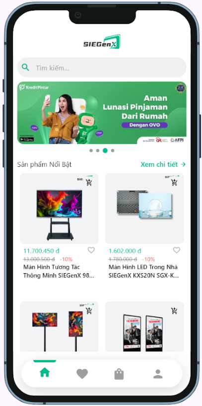
  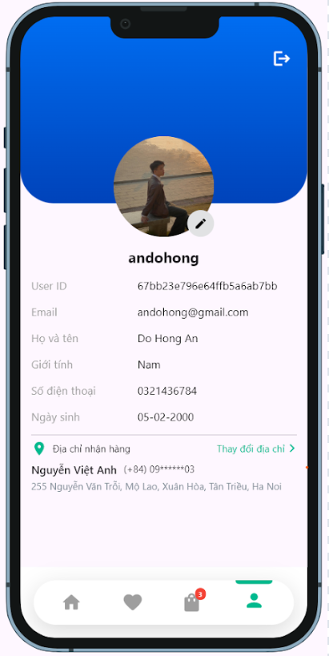
  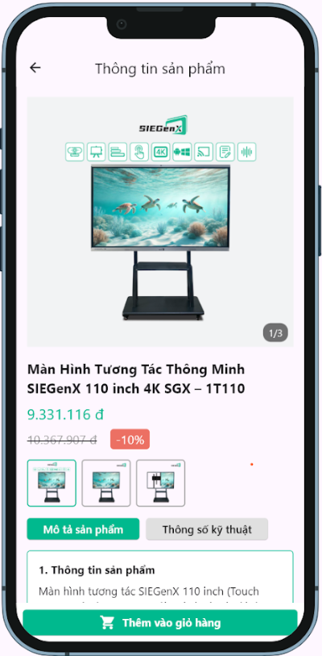
</p>

<p align="center">
  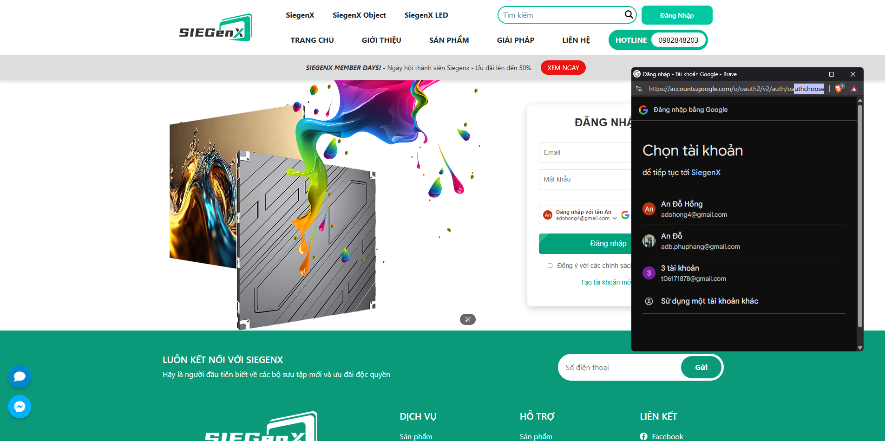<br>
  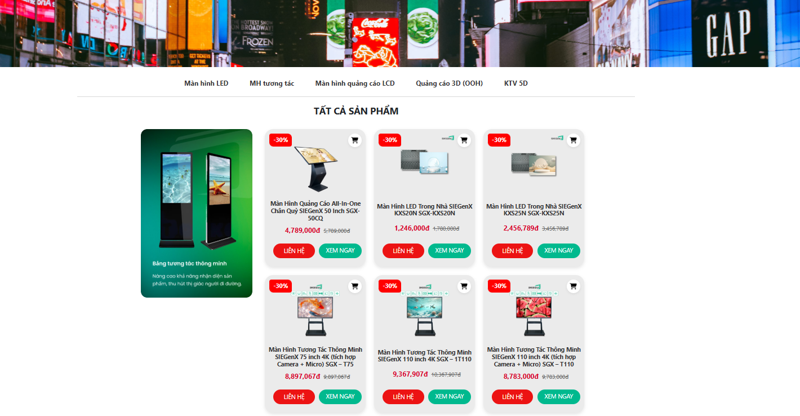<br>
  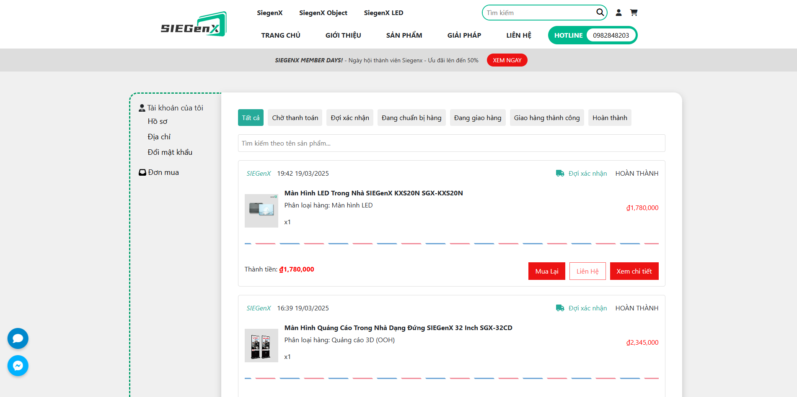<br>
  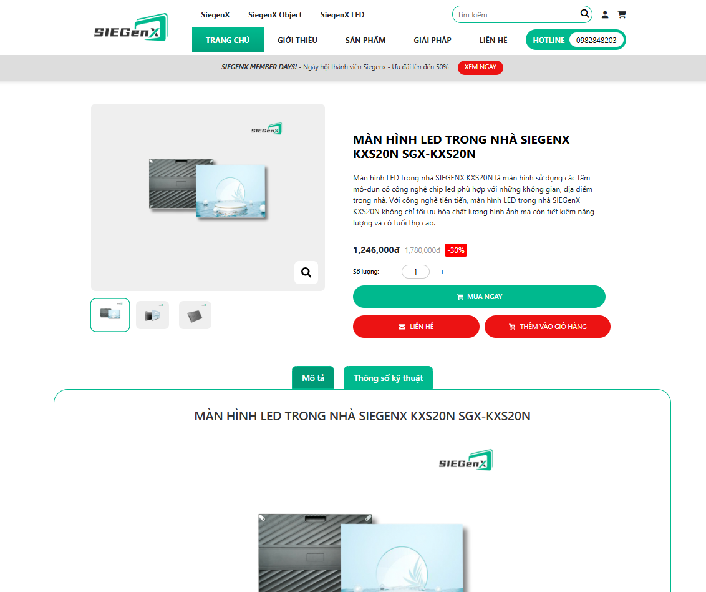<br>
  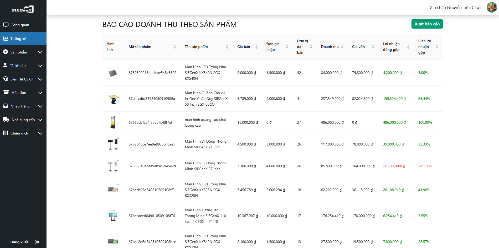<br>
  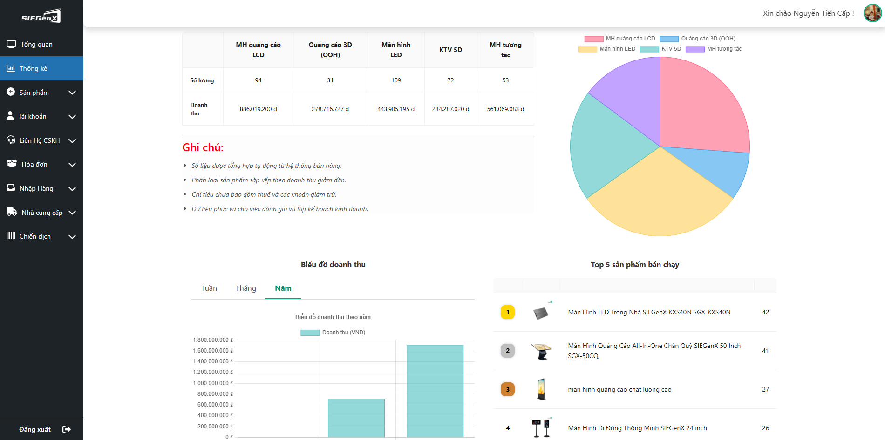<br>
  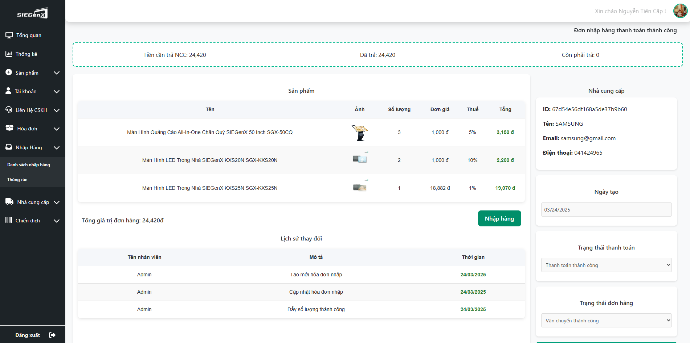<br>
  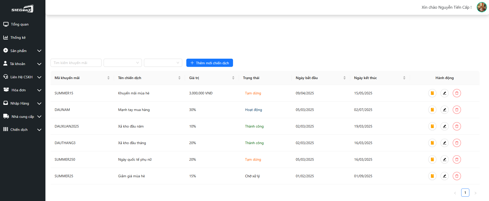
</p>

---

## 📁 Project Structure

```bash
siegenx/
├── backend/
│   ├── ApiGateway/             # Central entry point for routing requests to microservices
│   ├── ProductService/         # Handles product listing, inventory, and catalog operations
│   ├── IdentityService/        # Manages user authentication, registration, and token handling
│   ├── ProfileService/         # User profile management (addresses, preferences, etc.)
│   ├── StaffService/           # Internal staff management (roles, access, internal actions)
│   ├── SupplierService/        # Handles supplier data and business partnerships
│   ├── ContactService/         # Customer contact, feedback, and support messaging
│   ├── ThirdPaymentService/    # Integrates with external payment gateways (e.g., Momo, VNPay)
│   ├── LoadBalancer/           # Load balancing config to distribute traffic across services
│   └── Monitoring/             # Prometheus, Grafana, and logging configs for observability
├── frontend/
│   └── web/                    # ReactJS frontend for the main e-commerce website
├── mobile/
│   └── flutter-app/            # Cross-platform mobile shopping app built with Flutter
├── docs/
│   └── imageProject/           # Project images, product mockups, architecture diagrams
└── README.md                   # Project overview and documentation
